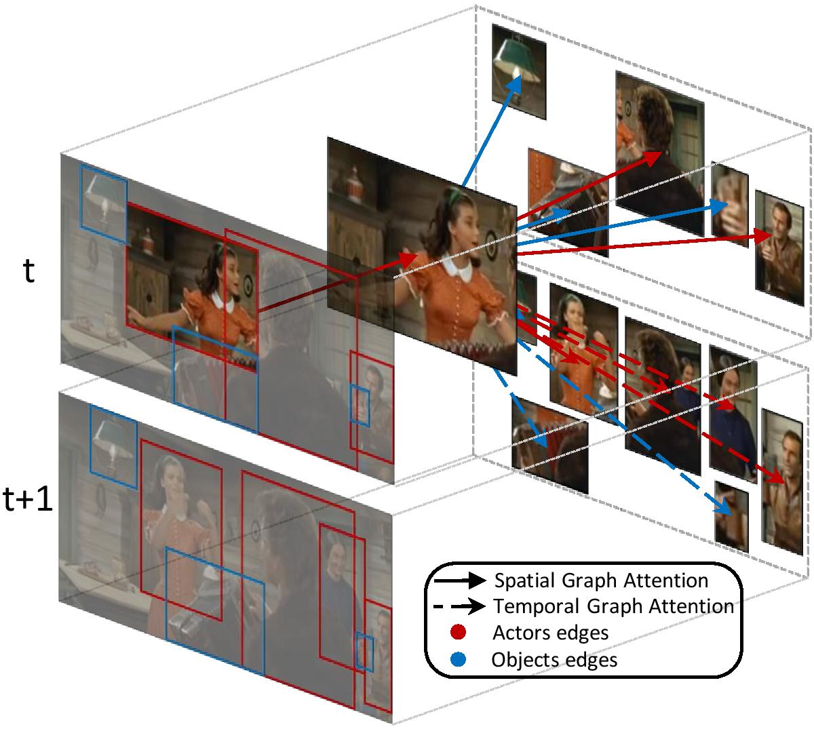

# STAGE: Spatio-Temporal Attention on Graph Entities
This repository contains the train and test code for the paper: "STAGE: Spatio-Temporal Attention on Graph Entities for Video Action Detection"

<p align="center">

</p>

## Requirements
The required Python packages are:
* torch>=1.0.0
* h5py>=2.8.0
* tensorboardX>=1.6

## Features
In order to train and test the module, you need pre-computed actors and objects features coming from a pre-trained backbone on the [AVA dataset](https://research.google.com/ava/). Features must be organized in h5py files as follows:

**Actors features**
  
    actors_features_dir
          |
          |-> <clipID1_dir>
          |       |-> <timestamp1>.h5
          |       |-> <timestamp2>.h5
          |       |
          |
          |-> <clipID2_dir>
          |       |-> <timestamp1>.h5
          |       |-> <timestamp2>.h5
          |       |
          |
       
Each <timestamp>.h5 file should contain the following data:
  * "features" -> a torch tensor with shape (num_actors, feature_size, t, h, w) containing actors features
  * "boxes" -> a torch tensor with shape (num_actors, 4) containing bounding boxes coordinates for each actor
  * "labels" -> a torch tensor with shape (num_actors, 81) containing ones and zeros for performed/not performed actions
  
**Objects features**

    objects_features.h5
    
The file should contain the following data:
  * "\<clipID\>_\<timestamp\>_features" -> a torch tensor with shape (num_objects, feature_size) containing objects features
  * "\<clipID\>_\<timestamp\>_boxes" -> a torch tensor with shape (num_objects, 4) containing bounding boxes coordinates for each object
  * "\<clipID\>_\<timestamp\>_cls_prob" -> a torch tensor with shape (num_objects, num_classes) containing objects probabilities for each class
  
For example, the objects features of the clipID '-5KQ66BBWC4' at timestamp '902' will be in 
     
    objects_features["5KQ66BBWC4_902_features"]
    
I3D actors features are available at the following links:
  * [[I3D_actors_train]](https://drive.google.com/open?id=1RlciPLrEQcY0uYecS_cEWydrpvWg9DZv)
  * [[I3D_actors_val]](https://drive.google.com/open?id=1HCjezdcr2BkVUIEJgzBKPYSYLA0a9vxw)

Each tar.gz contains a directory, which corresponds to the "actors_features_dir" root. 

Faster-RCNN objects features are available at the following links:
  * [[Faster-RCNN_objects_train]](https://drive.google.com/open?id=1xAgew9RaJeqq-dWPQgXdkpPT79uwv1nO)
  * [[Faster-RCNN_objects_val]](https://drive.google.com/open?id=17_9NkM0kB_j0YEersD6y5WRPcKL6fiLp)

Each tar.gz contains an h5py file, which corresponds to the "objects_features.h5" file. 

The size of all the features is ~90 GB.

## Training

Run `python train.py` using the following arguments:

| Argument | Value |
|------|------|
| `--actors_dir` | Path to the train actors_features_dir |
| `--objects_file ` | Path to the train objects_features.h5 file |
| `--output_dir ` | Path to the directory where checkpoints will be stored |
| `--log_tensorboard_dir ` | Path to the directory where tensorboard logs will be stored |
| `--batch_size ` | The batch size. Must be > 1 to allow temporal connections |
| `--n_workers ` | The number of workers |
| `--lr ` | The learning rate |

For example, use:
```
python train.py --actors_dir "./actors_features_dir" --objects_file "./objects_features.h5" --output_dir "./out_checkpoints" --log_tensorboard_dir "./out_tensorboard" --batch_size 6 --n_workers 8 --lr 0.0000625 
```

## Testing

Run `python test.py` using the following arguments:

| Argument | Value |
|------|------|
| `--actors_dir` | Path to the val actors_features_dir |
| `--objects_file ` | Path to the val objects_features.h5 file |
| `--output_dir ` | Path to the directory where the checkpoint to load is stored |
| `--batch_size ` | The batch size. Must be > 1 to allow temporal connections |
| `--n_workers ` | The number of workers |

A "results.csv" file will be created under the "output_dir" directory, which should be used for evaluation as explained [here](https://research.google.com/ava/download.html)

For example, use:
```
python test.py --actors_dir "./actors_features_dir" --objects_file "./objects_features.h5" --output_dir "./out_checkpoints" --batch_size 6 --n_workers 8
```

